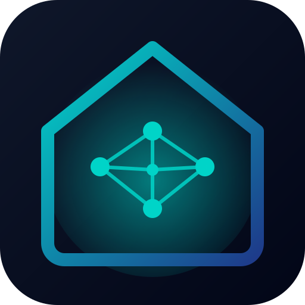
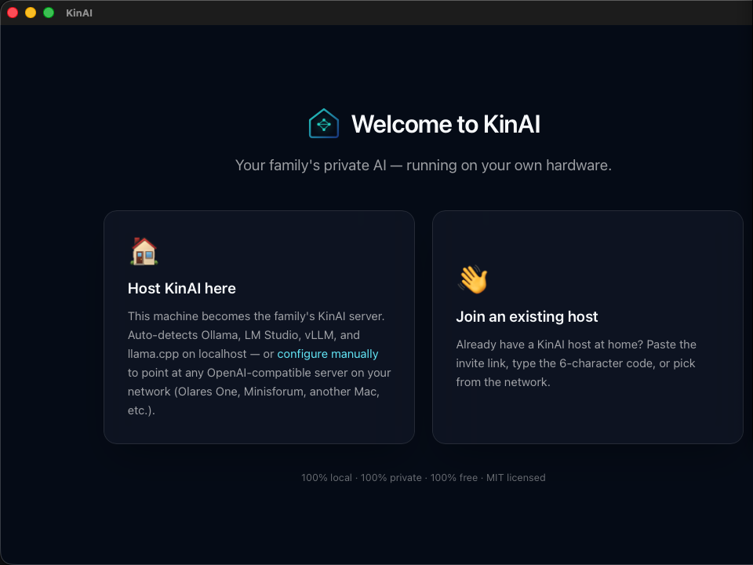
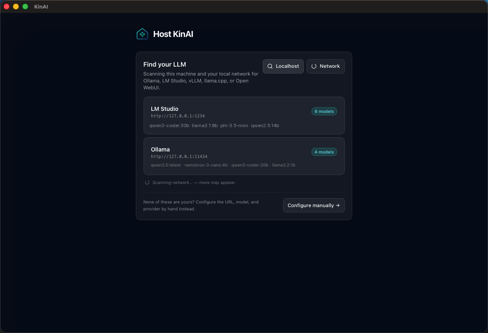
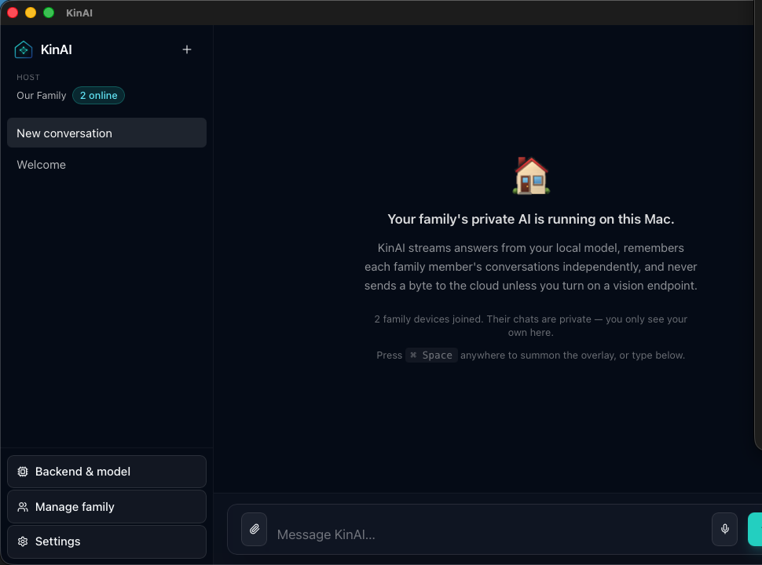
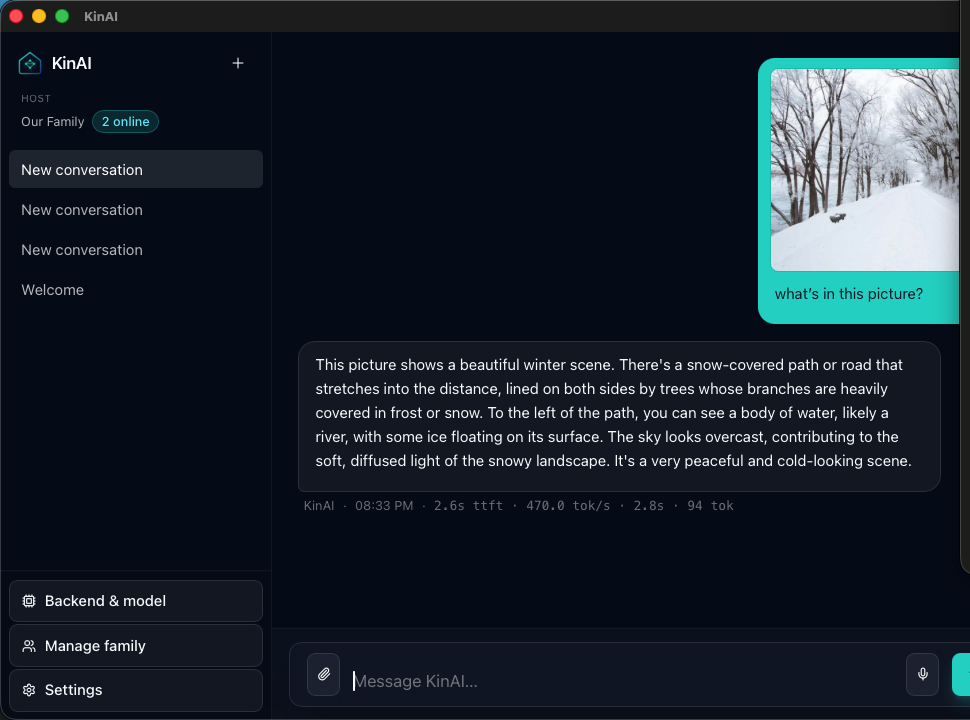
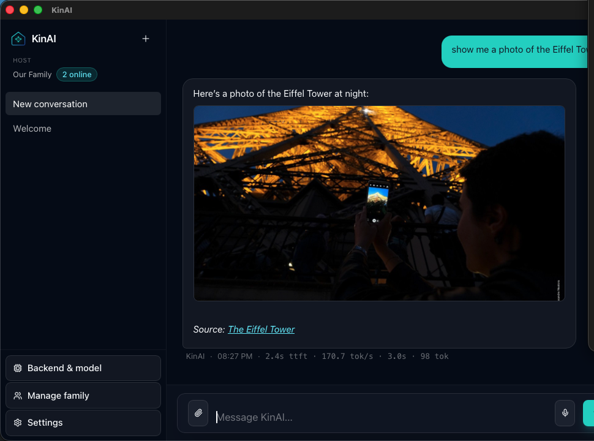

<div align="center">



# KinAI

**Share your private local AI with your family**

*KinAI isn't an AI — it's the **family-sharing layer** for the local LLM you already run. The LLM can live anywhere — Ollama on a Linux box, vLLM on a workstation, LM Studio on Windows, llama.cpp on a Mac mini, an Olares on your LAN. A Mac hosts KinAI and bridges to it. Mac + Windows clients today; phones reach it via the family's Telegram bot. No cloud, no accounts, each member's chat private to them.*

[](LICENSE)
[](https://tauri.app/)
[](https://www.rust-lang.org/)
[](https://kit.svelte.dev/)
[](https://github.com/Gogo6969/kinai/releases)
[](https://github.com/Gogo6969/kinai/releases)

[**Project home → kin-ai.replit.app**](https://kin-ai.replit.app)

</div>

> [!NOTE]
> macOS (host + client), Windows (client), and **Linux (client, beta)** are available. A Linux *host* isn't supported yet (the bridge runs on a Mac; your LLM can already live on Linux). Phones / tablets connect through the family's Telegram bot — no native iOS / Android app yet.

---

## ⚡ Five-second pitch

You already run a local LLM somewhere — Ollama on a Linux box, LM Studio on Windows, vLLM on a workstation, llama.cpp on a Mac mini, an Olares on your LAN, doesn't matter. KinAI is the **family-sharing layer** on top of it. Install KinAI on a Mac in **Host Mode**, point it at your existing LLM endpoint (`http://192.168.1.42:11434` or wherever). Install it on every other Mac or Windows device in **Client Mode** and join with a 6-character invite. Press **`Cmd+Space`** (macOS) / **`Ctrl+Space`** (Windows) from any app, ask anything, get an answer. Phones reach it through the family's shared Telegram bot — same model, same memory, same threads, no app store needed.

100% local. 100% private. 100% free. MIT licensed forever.

## 📸 Screenshots

<div align="center">

| | |
|:-:|:-:|
|  |  |
| *First launch — Host or Join* | *Auto-detects Ollama, LM Studio, vLLM, llama.cpp, Open WebUI* |
|  |  |
| *Host view — family's AI running on this Mac* | *Drop a photo, KinAI routes to your vision endpoint* |

<p>
  
  <br/>
  <em>Ask for a photo → KinAI calls <code>image_search</code> → result renders inline</em>
</p>

</div>

## 🚀 Install

You'll install KinAI **once on the host Mac** (which runs your local
LLM), and **once on every other family device** — Mac OR Windows.
Clients are lightweight: no model downloads, no LLM runtime, just a
chat window that talks to the host over your LAN.

Quick links to the section you need:

- [Host (Mac)](#host-mac--required)
- [Mac client](#mac-client)
- [Windows client](#windows-client)

---

## 🏠 Host (Mac) — required

You'll install KinAI **twice on Mac**: once on the Mac that has the LLM
(the *Host*), and once on every other Mac in your family (the
*Clients*).

### Step 1 — Get a local LLM running on the host Mac

KinAI doesn't bundle a model — it connects to one you already have. If
you don't have one yet, **[Ollama](https://ollama.com)** is the easiest
on-ramp:

1. Download Ollama from <https://ollama.com> (one-click installer).
2. Open **Terminal** (`Cmd+Space` → type "Terminal" → Enter — we'll
   fix the Spotlight conflict in a minute).
3. Run:

   ```bash
   ollama pull llama3.1:8b
   ```

   That's about a 5 GB download. When it's done, run `ollama list` to
   verify the model is installed.

> Other backends KinAI auto-detects on first launch: **LM Studio**,
> **vLLM**, **llama.cpp server**, **Open WebUI**. Any
> OpenAI-compatible endpoint works.

### Step 2 — Install KinAI on the host Mac

1. Go to the **[Releases page](https://github.com/Gogo6969/kinai/releases/latest)**.
2. Download the matching DMG under *Assets*:
   - **Apple Silicon** (M1/M2/M3/M4): `KinAI_*_aarch64.dmg`
   - **Intel Mac**: `KinAI_*_x64.dmg`
3. Double-click the downloaded `.dmg` file. A new window opens with
   the KinAI icon and an `Applications` shortcut.
4. **Drag `KinAI` onto the `Applications` folder shortcut** inside that
   window.
5. Open your **Applications** folder, find `KinAI`, and **right-click
   → Open** (not double-click — the right-click is important the
   first time).
6. macOS will warn: *"KinAI can't be opened because Apple cannot check
   it for malicious software."* This is normal for any app that
   isn't paid into the Apple Developer Program. Click **Open** in
   that dialog. You only have to do this once per Mac.
7. KinAI launches → click **🏠 Host KinAI here**.
8. The wizard auto-detects your local LLM in a few seconds → pick it
   → **Continue**, confirm the search engine + (optional) Vision
   endpoint → **Start hosting**.
9. From the chat sidebar, click **Manage family → + Invite**. You'll
   get a **6-character code** and a QR code — share one with each
   family member.

## 🖥️ Mac client

For every other Mac in the family that should connect to the host
above:

1. Download the same DMG from the **[Releases page](https://github.com/Gogo6969/kinai/releases/latest)**.
2. Drag `KinAI.app` into Applications, right-click → **Open** (same
   Gatekeeper dance as the host's Step 2.5–6 above).
3. Click **👋 Join an existing host**.
4. Type your name (this is how the host sees you in *Manage family*).
5. Either pick the host from the auto-discovered list, **or** type the
   **6-character code** from the host. Click **Connect**.
6. Done. Start chatting.

## 🪟 Windows client

For a Windows PC on the same home network as your host Mac:

1. Open the **[Releases page](https://github.com/Gogo6969/kinai/releases/latest)** in Edge / Chrome / Firefox.
2. Download **`KinAI_*_x64_en-US.msi`** under *Assets*. (There's also a
   `*_x64-setup.exe` — same app, NSIS-style installer. Either works.)
3. Double-click the downloaded `.msi`.

   **⚠️ Windows will probably block it at first.** A blue panel
   appears: *"Microsoft Defender SmartScreen prevented an unrecognised
   app from starting."*
   - Click the small **"More info"** link in that panel.
   - A new button appears: **"Run anyway"** — click it.
   - This happens because KinAI isn't yet signed with a Windows
     code-signing certificate. The Mac side is properly signed +
     notarised by Apple; Windows code-signing is a separate paid
     process we'll add later. The binary itself is identical to the
     one CI built from the public source — you can audit every line
     in this repo.

4. The MSI installer wizard runs (Next → Next → Install). KinAI lands
   in **Start Menu → KinAI**.
5. Launch it. Click **👋 Join an existing host**.
6. Type your name.
7. Paste the **`kinai://join?…` link** the host shared with you
   (`+ Invite → Copy link`), OR type the **6-character code** *and*
   pick the host from the auto-discovered list. Click **Connect**.
8. Done. Start chatting.

> **Windows client today is client-only.** It cannot run as a *host*
> yet — only macOS can host. The chat works both ways once paired
> (you ask, the Mac mini's local LLM answers), but the host machine
> stays Mac for now.

## 🐧 Linux client (beta)

For a Linux PC on the same network as your host Mac:

1. Download **`KinAI_*_amd64.AppImage`** from the
   **[Releases page](https://github.com/Gogo6969/kinai/releases/latest)**
   (or the `.deb` / `.rpm` if you prefer a native package).
2. Make it executable and run it:

   ```bash
   chmod +x KinAI_*_amd64.AppImage
   ./KinAI_*_amd64.AppImage
   ```

3. Click **👋 Join an existing host**, enter your name, pick the host
   from the discovered list (or paste the 6-char code / invite link),
   and **Connect**.

> **Beta — known limitations.** Core chat works. KinAI renders emoji in
> **monochrome** on Linux to dodge a WebKitGTK/Skia color-font crash.
> The global-hotkey **overlay** (`Ctrl+Space`) and the **tray icon** may
> not work under Wayland (a platform restriction on global key grabs /
> tray protocol) — the main window is unaffected. Voice replies / voice
> input are host-only (macOS). Tested on Fedora KDE (Wayland); other
> distros/desktops may vary.

### Daily use (both platforms)

Press **`Cmd+Space`** (macOS) / **`Ctrl+Space`** (Windows) anywhere to
summon the KinAI overlay — like Spotlight, but for your family's AI.
Type, press Enter, get an answer.

> **Hotkey conflict with Spotlight on macOS?** `Cmd+Space` is the
> default for both. Pick one to remap in **System Settings → Keyboard
> → Keyboard Shortcuts → Spotlight** (change Spotlight to e.g.
> `Cmd+Option+Space`), or change KinAI's hotkey in **KinAI → Settings
> → Overlay → Global hotkey**.

### Updates

When a new KinAI release goes out, your **host pulls it from GitHub
automatically** (within ~1 hour of the release going live) and serves
it to every connected family device. Each client shows a *"KinAI
vX.Y.Z is available · from your host"* banner; click **Install &
restart** and you're on the latest.

The Mac client side is fully auto-updating today.
**Windows auto-update inside the app is coming soon** — until then,
when you see the in-banner notice on Windows, re-download the latest
`.msi` from GitHub and reinstall over the top. Your settings + chat
history are preserved across reinstalls (they live in
`%USERPROFILE%\.kinai\`).

## 🧠 How context never gets lost

Every reply is built from four layers, in this order:

```
┌──────────────────────────────────────────┐
│  1. System prompt                         │  ← KinAI identity + house rules
├──────────────────────────────────────────┤
│  2. Long-term memory (FTS5 BM25)          │  ← top-N matches from past summaries
├──────────────────────────────────────────┤
│  3. Summarized history                    │  ← rolling summary of older turns
├──────────────────────────────────────────┤
│  4. Recent verbatim turns (last 50)       │  ← raw conversation
├──────────────────────────────────────────┤
│  5. Current user message                  │  ← always kept intact
└──────────────────────────────────────────┘
                  ↓
       Token guard (tiktoken-rs)
                  ↓
       Streamed to your local LLM
```

When a thread exceeds 30 unsummarized messages, the oldest are folded into a long-term memory note and indexed. The token guard reserves space for the response and never drops the current turn. Your conversations survive restarts, model switches, and months of family use.

## 🛠️ What's in v0.2

| Feature | Status |
|---|---|
| Global hotkey overlay (Spotlight-style, translucent) | ✅ |
| Host mode with **auto-detection** of Ollama, LM Studio, vLLM, llama.cpp, Open WebUI | ✅ |
| Client mode with one-click invite join (6-char code or QR) | ✅ |
| Push-to-talk **voice input** (macOS Speech Recognition) | ✅ |
| **PDF attachments** — drag-drop a PDF, model reads the text | ✅ |
| **Image attachments** + vision routing (CCC-style: chat-model-if-capable → Gemini Flash → Claude Haiku failover) | ✅ |
| **Image search** tool — find pictures via Wikimedia Commons (free) or Exa | ✅ |
| Safe inline image rendering (`https:` / `data:image/*` only, sandboxed) | ✅ |
| Built-in tools: web search, X/Twitter search, calculator, date/time, image search | ✅ |
| OpenAI-style function calling with tool execution loop | ✅ |
| Streaming responses (SSE) with **markdown + LaTeX + code blocks + tables** | ✅ |
| **Cross-thread search** — find any message across all your conversations as you type | ✅ |
| **Ask-while-busy queue** — fire a follow-up while a reply is still streaming; it queues and sends in order (per-thread, with a ⏹ Stop that clears the queue) | ✅ |
| **↑ / ↓ prompt history** — recall earlier prompts in the message box, terminal-style | ✅ |
| **⏹ Stop** — halt a running reply (or a runaway loop) from any surface, including clients over the LAN | ✅ |
| **Regenerate & edit-and-resend** — re-roll the last answer, or fix your question and re-run from there | ✅ |
| **Streaming Telegram replies** — the bot live-edits its message as the model writes | ✅ |
| **Image generation via ComfyUI** — `/pic` & `/picHQ` on every surface, with a "creating a picture…" progress note on Telegram | ✅ |
| **🔊 Voice replies** — `/voice` makes KinAI speak: Telegram voice notes per family member, auto-read-aloud replies on the host Mac. Fully local (macOS speech synthesis) | ✅ |
| System tray icon with **live status** (model, peers connected) | ✅ |
| Customizable hotkey, theme, font size | ✅ |
| **End-to-end JWT (RS256)** auth on every WebSocket connection | ✅ |
| **Per-peer context isolation** — family members' chats never bleed into each other | ✅ |
| Local SQLite database (SQLx + WAL + FTS5 memory) | ✅ |
| **mDNS** local-network host discovery | ✅ |
| **Host-distributed auto-updates** — host serves the binary, clients pull over LAN, with GitHub fallback for off-LAN | ✅ |
| Rate limiting per client to prevent abuse | ✅ |
| Invite expiry (default 30 days) + revoke | ✅ |
| Family management (see peers, kick) | ✅ |
| Exponential-backoff reconnect supervisor (works through host restarts) | ✅ |

## 🗂️ Supported backends

| Backend | Auto-detected port | Notes |
|---|---|---|
| [Ollama](https://ollama.com/) | `11434` | First-class, model list via `/api/tags` |
| [LM Studio](https://lmstudio.ai/) | `1234` | OpenAI-compatible `/v1` |
| [vLLM](https://docs.vllm.ai/) | `8000` | OpenAI-compatible |
| [llama.cpp server](https://github.com/ggerganov/llama.cpp) | `8080` | OpenAI-compatible |
| [Open WebUI](https://openwebui.com/) | `8888` | OpenAI-compatible |
| Anything else with OpenAI-compatible REST | any | Set base URL manually |

## 🔐 Privacy

**Your data never leaves your computer.** KinAI has no telemetry, no analytics, no user accounts, no remote logging. Conversations live in `~/.kinai/kinai.db` on the host machine. Clients hold an invite JWT and nothing else. The repository contains every line of code that runs.

## 🗺️ Roadmap

| Version | Focus | Highlights |
|---|---|---|
| **v0.1** | MVP | Hotkey overlay, host/client, invite + JWT, tools, mDNS *(macOS)* |
| **v0.2** ⬅ *current* | Vision, attachments, family-grade updates | PDFs, image attach + vision routing, image search inline, host-distributed signed updates, per-peer context isolation, reconnect supervisor, cross-thread search, regenerate / edit-and-resend, streaming Telegram replies, ComfyUI image generation, voice replies (TTS) |
| **v0.3** | Image generation + web-page ingest | ComfyUI / A1111 routing, page-to-context |
| **v0.4** | RAG basics | Doc upload + vector search |
| **v0.5** | Mobile + voice | iOS / Android via Tauri Mobile, Whisper STT + Piper TTS, voice-thread memory |

*Windows and Linux clients are available; a Linux host is not yet supported.*
| **v1.0** | Plugins & polish | Custom-tool marketplace, multi-host switcher, admin dashboard, Olares One deep integration |
| **v2.0+** | Family knowledge | Advanced RAG over photos / PDFs / recipes, real-time translation |

All releases stay 100% open-source, local-first, and free forever.

## 🏗️ Architecture

```
┌──────────────────────────────────────────────────────────┐
│  Family devices (Clients)                                 │
│  macOS                                                    │
│         ▼ hotkey / chat / attach PDF or photo ▼           │
│        KinAI Overlay  →  WS Envelope                      │
└──────────────────────────┬───────────────────────────────┘
                           │  JWT-authenticated WebSocket
                           │  + mDNS LAN discovery
                           ▼
┌──────────────────────────────────────────────────────────┐
│  Host machine                                             │
│  ┌────────────────────────────────────────────────────┐  │
│  │ KinAI (Tauri 2 + Rust + Axum)                      │  │
│  │  • Per-peer context builder (threads + FTS5 memory)│  │
│  │  • PDF text extraction (pdf-extract)               │  │
│  │  • Vision router (chat-model → primary → failover) │  │
│  │  • Tool execution loop (web/x/image search + calc) │  │
│  │  • Streaming chat completion (SSE)                 │  │
│  │  • Host-served signed updates (LAN, Minisign)      │  │
│  └────────┬───────────────────────────────┬───────────┘  │
│           ▼                                ▼              │
│  ┌────────────────────┐         ┌───────────────────┐    │
│  │ Local LLM          │         │ Vision endpoint   │    │
│  │ (Ollama / LMS /…)  │         │ (Gemini, llava,…) │    │
│  └────────────────────┘         └───────────────────┘    │
└──────────────────────────────────────────────────────────┘
```

Each family member's chats live in their own bucket on the host's
SQLite — keyed by their invite's short code. Mom's "what did I tell
you about my recipes?" never sees Dad's prompts; the model never
recalls another peer's history.

**Stack:**

- **Shell**: Tauri 2 — single ~25 MB binary per OS
- **Backend**: Rust + Axum + Tokio + SQLx + jsonwebtoken (RS256)
- **Frontend**: SvelteKit (runes) + TailwindCSS + Lucide icons
- **Rendering**: `marked` + `marked-highlight` + `highlight.js` + KaTeX, with a safe-image allow-list
- **Networking**: WebSocket + mDNS-SD local discovery
- **Tokenization**: `tiktoken-rs` (cl100k)
- **PDF extraction**: `pdf-extract` (pure Rust)
- **Vision routing**: pluggable OpenAI-multipart endpoints (Gemini OpenAI-compat, Anthropic OpenAI-compat, llava/qwen-vl via Ollama/vLLM)
- **Updates**: signed (Minisign) bundles served from the host over LAN, GitHub Releases as off-LAN fallback

## 🧱 Repository layout

```
kinai/
├── src/                    # Rust backend
│   ├── auth/               # JWT (RS256) issuance + validation
│   ├── attachments.rs      # PDF text extraction (pdf-extract, pure Rust)
│   ├── context/            # never-lose-context builder + summarizer + token guard
│   ├── db/                 # SQLx + migrations + per-peer threads + memory FTS5
│   ├── llm/                # stream + auto-detect (Ollama/LMS/vLLM/llama.cpp)
│   ├── network/            # Axum HTTP+WS server, client dialer, invite, rate-limit, host-served updates
│   ├── tools/              # web/x/image search + calculator/datetime + execution loop
│   ├── vision.rs           # image-turn router: chat-model-if-capable, else primary, else failover
│   ├── commands.rs         # Tauri IPC surface
│   ├── tray.rs             # system tray + live status ticker
│   ├── hotkey.rs           # global shortcut
│   ├── discovery.rs        # mDNS advertise + browse
│   └── updater.rs          # host-first periodic check, GitHub fallback
├── frontend/               # SvelteKit app
│   └── src/
│       ├── routes/         # /, /host, /host/invite, /host/family, /client, /settings, /overlay
│       ├── lib/components/ # Logo, Sidebar, ChatWindow, Overlay, MessageBubble, ToolPill, UpdateBanner
│       ├── lib/markdown.ts # marked + highlight.js + KaTeX + safe inline images
│       └── lib/api.ts      # typed wrappers over every command + event
├── public/icons/           # SVG + PNG + ICO + ICNS bundle assets
├── docs/                   # host-guide.md, client-guide.md, screenshots/
├── .github/workflows/      # CI build matrix + release.yml
├── Cargo.toml
├── tauri.conf.json
└── README.md
```

## 🛠️ Build from source

Requirements: Rust stable, Node 20+, pnpm 9.

```bash
git clone https://github.com/Gogo6969/kinai
cd kinai

pnpm install                    # also installs frontend workspace
pnpm tauri dev                  # dev build (auto-reload)
pnpm tauri build                # production binary for this OS

# Bundle output:
#   macOS:   target/release/bundle/dmg/*.dmg + macos/*.app.tar.gz (updater)

# Signing updater bundles (optional, host-distributed updates need this):
#   pnpm tauri signer generate -w ~/.kinai/keys/updater.key --ci
#   # then put the contents of the .pub file in tauri.conf.json plugins.updater.pubkey
#   # and the private key path in TAURI_SIGNING_PRIVATE_KEY when running build
```

## 🔧 Forking & rebranding

KinAI's source has **one place to edit** when forking — the repository URL
lives in `Cargo.toml`'s `[package].repository` field, and every other spot
that needs it reads it at compile time via `env!("CARGO_PKG_REPOSITORY")`:

- The HTTP `User-Agent` strings sent by `web_search` / `x_search`.
- The "GitHub" link on the About page (`/about`).
- The full version-identifier string the Settings page lets you copy.

Two things you'll also want to update for a real release of your fork:

1. **`tauri.conf.json` → `plugins.updater.endpoints`** — point this at your
   fork's releases JSON, otherwise auto-updates check the wrong repo.
2. **`tauri.conf.json` → `identifier`** — change `ai.kin.desktop` to your
   own reverse-DNS bundle id so macOS treats your app as separate.

Nothing else in the source tree has hardcoded URLs, account names, or
machine paths — the user's home directory (`~/.kinai/`) is auto-resolved,
the LAN scanner discovers its own subnet, and the LLM backend / Exa key /
hotkey / family name are all entered in-app at setup time. Everything is
designed to run unchanged on every household's hardware.

## 🤝 Contributing

KinAI is community-built. The way you can help today:

1. **Ship the MVP on more backends.** Test with TGI, mlc-llm, Open WebUI variants, and report what auto-detect misses.
2. **Skin & polish.** SvelteKit + Tailwind — pull requests with cleaner empty states or dark/light theme variants land fast.
3. **Tool authors.** Write a tool (Rust function + JSON schema). Drop it in [`src/tools/`](src/tools/) and wire into [`registry.rs`](src/tools/registry.rs).
4. **Bug reports.** Open an issue with your OS, backend, and the `~/.kinai/kinai.log` excerpt.

PRs that touch the protocol, JWT format, or context pipeline get extra review attention — please open an issue first.

## 📜 License

MIT — see [LICENSE](LICENSE). Forever free, forever yours.

---

<div align="center">

**KinAI — bring your family their own AI, on your own terms.**

[Host guide](docs/host-guide.md) · [Client guide](docs/client-guide.md)

</div>
